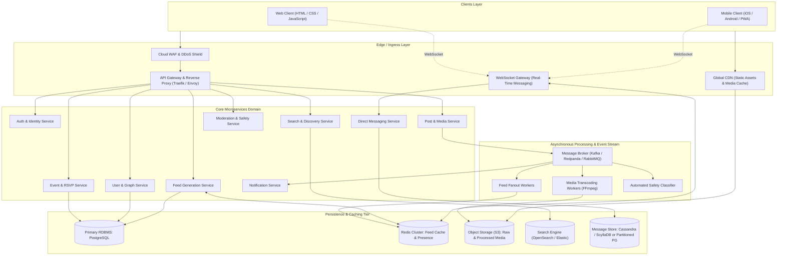
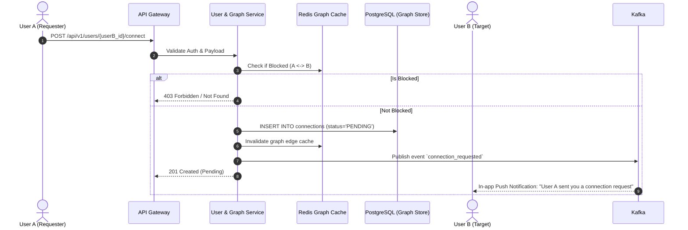
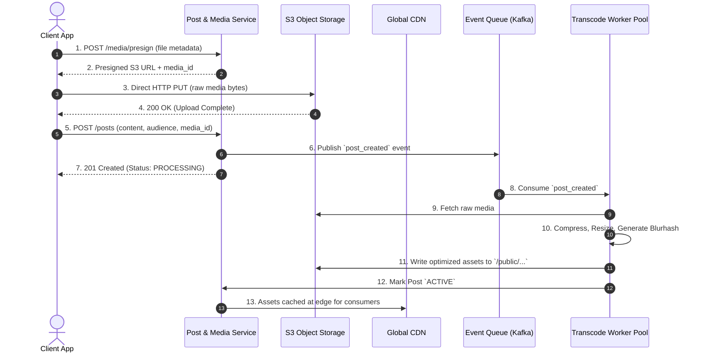
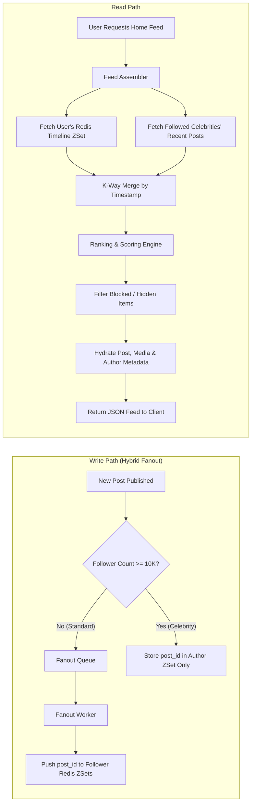
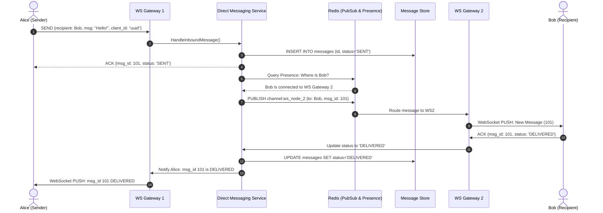
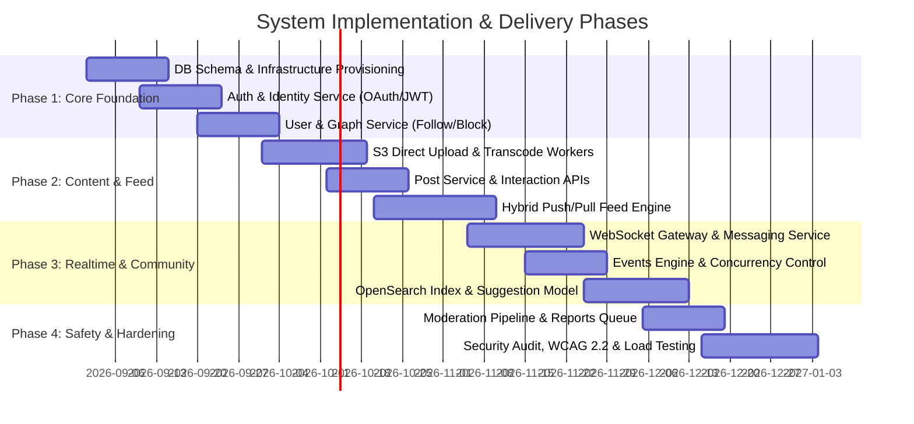

# System Design Document (SDD)

## Product: Social Connectivity Platform

**Document Version:** 1.0 (Architecture Baseline)  
**Corresponding PRD:** [Product Requirements Document](file:///c:/Users/A/OneDrive/Documents/FED-FW/SEM%20PROJECT/Product%20Requirements%20Document.md)  
**Author:** Software Architecture & Engineering Team  
**Date:** September 2026  

**Current web implementation:** Plain HTML, CSS, and JavaScript ES modules. Native DOM events, WebSocket, WebGL, and MediaRecorder APIs drive the interface. Vite is used only for development and static builds. See [README.md](README.md) for the local demo setup; the distributed services below describe the broader architecture target.

---

## 1. Executive Summary & Scope

This document details the complete, step-by-step system design for the **Social Connectivity Platform** defined in the [Product Requirements Document](file:///c:/Users/A/OneDrive/Documents/FED-FW/SEM%20PROJECT/Product%20Requirements%20Document.md). The platform integrates rich user profiles, multimedia posting, personalized algorithmic feeds, one-to-one real-time messaging, event management with RSVP workflows, discovery/friend suggestions, and safety/moderation tooling.

### 1.1 Key Architecture Goals

1. **Low-latency Read Paths:** Deliver home feed and user profile views in under **200ms** at the 95th percentile ($P_{95}$).
2. **Real-time Messaging Delivery:** Sub-second (median $<50\text{ms}$) direct message delivery via persistent WebSocket connections.
3. **Resilient Media Pipeline:** Direct client-to-object-storage uploads with asynchronous media optimization, transcode workers, and CDN caching.
4. **Hybrid Fanout Feed Architecture:** Combining **Fanout-on-Write** (push) for typical users and **Fanout-on-Read** (pull) for high-follower entities to prevent write amplification.
5. **Strict Data Isolation & Privacy:** Zero leakage across blocked accounts, private audience boundaries, and pending message requests.

---

## 2. Capacity Estimations & Scale Assumptions

To size our storage, bandwidth, and compute tiers accurately, we establish conservative MVP baseline scale metrics and 1-year growth targets:

| Metric | MVP Target | 1-Year Scale Target | Notes |
| --- | --- | --- | --- |
| **Daily Active Users (DAU)** | 50,000 | 1,000,000 | Baseline active cohort |
| **Monthly Active Users (MAU)** | 200,000 | 5,000,000 | ~4:1 MAU:DAU ratio |
| **Read-to-Write Ratio** | 50:1 to 100:1 | 100:1 | Heavy content browsing |
| **New Posts / Day** | 100,000 | 2,000,000 | ~2 posts per active creator |
| **Media Attachments** | 60% images, 15% video | 60% images, 15% video | 25% text-only |
| **Direct Messages / Day** | 500,000 | 15,000,000 | Conversational exchanges |

### Storage & Bandwidth Sizing

- **Post Metadata:** $2\times 10^6 \text{ posts/day} \times 1\text{ KB/record} = 2\text{ GB/day} \approx 730\text{ GB/year}$.
- **Media Ingestion:** Average image = $2\text{ MB}$, compressed to WebP ($400\text{ KB}$). Average video clip = $15\text{ MB}$, transcoded to H.264/MP4 ($5\text{ MB}$).
  - Raw Ingestion: $(1.2\times 10^6 \times 2\text{ MB}) + (3\times 10^5 \times 15\text{ MB}) = 2.4\text{ TB} + 4.5\text{ TB} = 6.9\text{ TB/day}$.
  - Storage & CDN egress: Handled via S3-compatible object storage paired with a global Content Delivery Network (Cloudflare / CloudFront).
- **Messaging:** $15\times 10^6 \text{ msgs/day} \times 500\text{ bytes} \approx 7.5\text{ GB/day} \approx 2.7\text{ TB/year}$.

---

## 3. High-Level Architecture

The platform uses a **Modular Distributed Services Architecture**. A central API Gateway terminates external traffic, manages rate limiting and authentication verification, and routes requests to domain services backed by polyglot data persistence tiers.



---

## 4. Step-by-Step Detailed System Design

### Step 1: Authentication, Authorization & Identity Management

- **Protocol:** Stateless token-based security using **OAuth 2.0 / OIDC** with JSON Web Tokens (JWT).
  - Short-lived Access Token: 15-minute validity, RS256 signed. Contains `user_id`, `role`, and token version (`token_ver`).
  - Refresh Token: 7-day or 30-day validity, opaque token stored securely in `httpOnly, secure, SameSite=Strict` cookies, with corresponding hash in Redis.
- **Session Revocation & Logout:** A token blacklist or user generation counter (`token_version`) stored in Redis allows immediate revocation on password reset or suspicious activity.
- **Role-Based Access Control (RBAC):** Roles include `standard_user`, `verified_user`, `moderator`, `admin`. Permission middleware verifies scopes on every API endpoint.

---

### Step 2: User Graph & Relationship Management

- **Relationship Model:** Hybrid bidirectional and unidirectional support:
  - `FOLLOW`: Unidirectional relationship (User A follows User B).
  - `CONNECT`: Bidirectional relationship requiring request and accept states (`PENDING`, `ACCEPTED`, `REJECTED`).
  - `BLOCK`: Strict bilateral visibility termination.
- **Bidirectional Block Enforcement:** When User A blocks User B:
  1. A `blocks` record is committed (`blocker_id = A, blocked_id = B`).
  2. Any existing follow or friend connection between A and B is immediately purged.
  3. Redis Bloom filters or fast hash lookups `is_blocked(userA, userB)` verify relationship boundaries across feed queries, user search, profile views, and messaging.



---

### Step 3: Post Ingestion & Asynchronous Media Processing Pipeline

Direct file uploads through application servers consume excessive memory and saturate web thread pools. We implement a **Two-Phase Direct-to-Storage Upload Pattern**:

1. **Step 3.1: Pre-Signed Upload Authorization:**
   - The client requests an authorized upload ticket: `POST /api/v1/media/presign` specifying MIME type, byte size, and asset intent (`post_attachment`, `avatar`, `event_cover`).
   - The Media Service verifies file constraints (e.g., JPEG/PNG/WebP $\le 15\text{MB}$, MP4/MOV $\le 100\text{MB}$) and generates an S3 Presigned PUT URL with an encrypted object key: `s3://uploads/raw/{userId}/{uuid}.ext`.
2. **Step 3.2: Direct Client Upload:**
   - The client streams bytes directly to S3 via HTTP PUT with chunked resumable upload capabilities (Tus protocol or S3 Multipart Upload).
3. **Step 3.3: Post Publication & Async Processing:**
   - Upon upload completion, client calls `POST /api/v1/posts` containing text, audience setting, and `media_keys`.
   - Post metadata is saved in PostgreSQL with status `PROCESSING`.
   - An event `media_ingested` is dispatched to Kafka.
   - Asynchronous FFmpeg/ImageMagick workers consume the task:
     - Generate WebP responsive image variants ($320\text{w}, 640\text{w}, 1280\text{w}$).
     - Transcode videos to H.264/MP4 multi-bitrate and produce video poster thumbnails.
     - Extract metadata (dimensions, blurhash for instant placeholder rendering).
   - Once processed, media status changes to `READY`, and the post becomes eligible for feed distribution.



---

### Step 4: News Feed Architecture (Hybrid Push & Pull)

The feed system must handle both high-velocity writes and sub-200ms reads without write amplification bottlenecks.

#### 4.1 The Fanout Strategy

- **Regular Users ($< 10,000$ followers):** **Fanout-on-Write (Push Model)**.
  - When a user posts, a background worker retrieves their followers and pushes the `post_id` directly into each follower's timeline in Redis (`ZSET timeline:user:{id}` where `score = timestamp`).
  - Read path for regular followers is $O(1)$: simply fetch the top $N$ items from their Redis sorted set.
- **Celebrities / High-Follower Accounts ($\ge 10,000$ followers):** **Fanout-on-Read (Pull Model)**.
  - Pushing a post to 2,000,000 followers causes massive write spikes and queue delays.
  - Celebrity posts are not pushed to follower inboxes. Instead, when a follower requests their feed, the system queries the celebrity's recent posts and merges them into the timeline at read time.
- **Hybrid Merge at Read Time:**
  $$\text{Feed}(u) = \text{MergeSort}(\text{PushTimeline}(u), \text{PullPosts}(\text{FollowedCelebrities}(u)))$$

#### 4.2 Ranking Scoring Formulation

Candidate items in the merged pool are scored and ordered using a weighted ranking algorithm:

$$S(p, u) = w_{\text{rel}} \cdot R(u, \text{author}) + w_{\text{rec}} \cdot e^{-\lambda \Delta t} + w_{\text{eng}} \cdot (\alpha \cdot L_p + \beta \cdot C_p) - w_{\text{pen}} \cdot P_p$$

Where:

- $R(u, \text{author})$ is relationship proximity (mutual friends, direct message history).
- $e^{-\lambda \Delta t}$ is time-decay penalty ($\Delta t$ is hours since creation).
- $L_p, C_p$ are normalized like and comment counts.
- $P_p$ is negative signal penalty (prior hide, report, mute triggers).
- **Diversity Filter:** Deduplicates authors so that no single creator occupies more than 2 consecutive slots in the top 10 items.



---

### Step 5: Real-Time Direct Messaging System

Direct messaging requires low latency, strict ordering, delivery guarantees, and privacy controls (message request routing).

#### 5.1 Connection Layer & Gateway

- Clients maintain a persistent **WebSocket (WSS)** connection to the `WebSocket Gateway`.
- The Gateway maps `user_id -> connection_id -> socket_descriptor`.
- A global Redis cluster maintains a distributed lookup table: `user:presence:{user_id} -> gateway_server_ip`.

#### 5.2 Message Flow

1. User A sends message to User B over their active WebSocket.
2. Gateway checks relationship permissions:
   - If User B has blocked User A: Discard or return delivery failure.
   - If User B and User A are mutual friends: Deliver to primary inbox.
   - If User B does not follow User A: Route to `Message Requests` inbox.
3. Message is persisted to the message database with state `SENT` and assigned a monotonically increasing, time-ordered sequence identifier (Twitter Snowflake or ULID).
4. Gateway queries Redis for User B's current Gateway node:
   - **User B is Online:** Message is published over Redis Pub/Sub to User B's Gateway node, which sends the payload down User B's socket. Client acknowledges receipt $\rightarrow$ state becomes `DELIVERED`.
   - **User B is Offline:** Message is queued into the Notification Service to trigger an Apple APNs or Google FCM push alert.
5. User B reads the message: Client sends `read_ack` $\rightarrow$ state becomes `READ`.



---

### Step 6: Events & RSVP Management

Events combine structured entity lifecycle management with high-concurrency capacity counters:

1. **Event Lifecycle:** `DRAFT` $\rightarrow$ `PUBLISHED` $\rightarrow$ `STARTED` $\rightarrow$ `COMPLETED` / `CANCELLED`.
2. **Concurrency Control on Limited Capacity:**
   - To avoid race conditions when multiple users RSVP simultaneously for an event with capacity $C$:
   - **Optimistic Locking:**

     ```sql
     UPDATE events 
     SET current_attendees = current_attendees + 1, version = version + 1
     WHERE id = :event_id 
       AND current_attendees < capacity 
       AND version = :expected_version;
     ```

   - Alternatively, at high scale, maintain a Redis atomic counter: `DECR event:{id}:available_tickets`. If the counter yields $<0$, immediately return `Sold Out / Capacity Reached` without touching PostgreSQL.
3. **RSVP Consistency:** A transactional record is saved in `event_rsvps` table (`event_id`, `user_id`, `status='GOING'`). If an event is cancelled by the organizer, an asynchronous worker broadcasts cancellation notices to all confirmed attendees.

---

### Step 7: Search, Discovery & Friend Suggestions

- **Search Architecture:** Read models are projected from PostgreSQL into an **OpenSearch / Elasticsearch** cluster via Debezium Change Data Capture (CDC) or asynchronous Kafka listeners.
  - Search indices: `users_index` (username, display name, bio, interest tags) and `events_index` (title, description, location, date).
- **Friend Suggestion Algorithm (Graph Triadic Closure & Shared Interests):**
  - Offline / Batch scoring job runs periodically:
    $$\text{Score}(u, v) = w_1 \cdot |N(u) \cap N(v)| + w_2 \cdot |I(u) \cap I(v)| + w_3 \cdot |E(u) \cap E(v)|$$
    Where $N(u)$ is the set of friends of user $u$ (mutual connections), $I(u)$ is interests, and $E(u)$ is attended events.
  - Excludes any user who has an active `BLOCK`, is already connected, or has been previously `DISMISSED` by user $u$ within the past 30 days.

---

### Step 8: Safety, Moderation & Privacy Engine

1. **Multi-Layer Moderation Pipeline:**
   - **Layer 1 (Synchronous Fast Check):** Regex and heuristic word/link filter on post creation to reject known malicious URLs, spam phrases, or illegal content.
   - **Layer 2 (Asynchronous Machine Learning Classification):** Images, videos, and post text are submitted via Kafka to vision and NLP classifiers (NSFW detection, hate speech scoring). Content exceeding confidence thresholds is automatically hidden and routed to the urgent moderation queue.
   - **Layer 3 (Human Review Workflow):** User-submitted reports (`POST /reports`) aggregate into a dedicated moderator dashboard with audit logs, priority triage, and penalty actions (`WARN`, `SUSPEND_3_DAYS`, `PERMANENT_BAN`, `DISMISS`).
2. **Audit & Compliance:**
   - Immutable audit log table records moderator identity, target item, evidence snapshot, timestamp, and justification.

---

## 5. Comprehensive Database Schema (PostgreSQL)

```sql
-- 1. USERS & PROFILES
CREATE TABLE users (
    id UUID PRIMARY KEY DEFAULT gen_random_uuid(),
    username VARCHAR(32) UNIQUE NOT NULL,
    email VARCHAR(255) UNIQUE NOT NULL,
    password_hash VARCHAR(255) NOT NULL,
    role VARCHAR(20) NOT NULL DEFAULT 'standard_user',
    status VARCHAR(20) NOT NULL DEFAULT 'ACTIVE', -- ACTIVE, SUSPENDED, DELETED
    token_version INT NOT NULL DEFAULT 1,
    created_at TIMESTAMPTZ NOT NULL DEFAULT NOW(),
    updated_at TIMESTAMPTZ NOT NULL DEFAULT NOW()
);

CREATE TABLE profiles (
    user_id UUID PRIMARY KEY REFERENCES users(id) ON DELETE CASCADE,
    display_name VARCHAR(64) NOT NULL,
    avatar_url TEXT,
    bio VARCHAR(500),
    location VARCHAR(100),
    interests TEXT[], -- Array of interest tags e.g. {'tech', 'music', 'art'}
    privacy_setting VARCHAR(20) NOT NULL DEFAULT 'PUBLIC', -- PUBLIC, CONNECTIONS_ONLY, PRIVATE
    created_at TIMESTAMPTZ NOT NULL DEFAULT NOW(),
    updated_at TIMESTAMPTZ NOT NULL DEFAULT NOW()
);

-- 2. SOCIAL GRAPH & RELATIONSHIPS
CREATE TABLE relationships (
    id UUID PRIMARY KEY DEFAULT gen_random_uuid(),
    requester_id UUID NOT NULL REFERENCES users(id) ON DELETE CASCADE,
    target_id UUID NOT NULL REFERENCES users(id) ON DELETE CASCADE,
    type VARCHAR(20) NOT NULL, -- FOLLOW, CONNECT
    status VARCHAR(20) NOT NULL, -- PENDING, ACCEPTED, REJECTED
    created_at TIMESTAMPTZ NOT NULL DEFAULT NOW(),
    updated_at TIMESTAMPTZ NOT NULL DEFAULT NOW(),
    CONSTRAINT unique_relation UNIQUE(requester_id, target_id, type)
);

CREATE TABLE blocks (
    blocker_id UUID NOT NULL REFERENCES users(id) ON DELETE CASCADE,
    blocked_id UUID NOT NULL REFERENCES users(id) ON DELETE CASCADE,
    created_at TIMESTAMPTZ NOT NULL DEFAULT NOW(),
    PRIMARY KEY(blocker_id, blocked_id)
);

-- 3. POSTS & MEDIA ASSETS
CREATE TABLE posts (
    id UUID PRIMARY KEY DEFAULT gen_random_uuid(),
    author_id UUID NOT NULL REFERENCES users(id) ON DELETE CASCADE,
    content TEXT NOT NULL,
    visibility VARCHAR(20) NOT NULL DEFAULT 'PUBLIC', -- PUBLIC, CONNECTIONS_ONLY, PRIVATE
    status VARCHAR(20) NOT NULL DEFAULT 'ACTIVE', -- DRAFT, PROCESSING, ACTIVE, REMOVED
    likes_count INT NOT NULL DEFAULT 0,
    comments_count INT NOT NULL DEFAULT 0,
    created_at TIMESTAMPTZ NOT NULL DEFAULT NOW(),
    updated_at TIMESTAMPTZ NOT NULL DEFAULT NOW()
);
CREATE INDEX idx_posts_author_created ON posts(author_id, created_at DESC) WHERE status = 'ACTIVE';

CREATE TABLE media_assets (
    id UUID PRIMARY KEY DEFAULT gen_random_uuid(),
    post_id UUID REFERENCES posts(id) ON DELETE CASCADE,
    owner_id UUID NOT NULL REFERENCES users(id),
    asset_type VARCHAR(20) NOT NULL, -- IMAGE, VIDEO
    storage_key TEXT NOT NULL,
    cdn_url TEXT NOT NULL,
    blurhash VARCHAR(64),
    width INT,
    height INT,
    duration_sec INT,
    processing_status VARCHAR(20) NOT NULL DEFAULT 'PENDING', -- PENDING, READY, FAILED
    created_at TIMESTAMPTZ NOT NULL DEFAULT NOW()
);

-- 4. INTERACTIONS (LIKES & COMMENTS)
CREATE TABLE post_likes (
    user_id UUID NOT NULL REFERENCES users(id) ON DELETE CASCADE,
    post_id UUID NOT NULL REFERENCES posts(id) ON DELETE CASCADE,
    created_at TIMESTAMPTZ NOT NULL DEFAULT NOW(),
    PRIMARY KEY(user_id, post_id)
);

CREATE TABLE comments (
    id UUID PRIMARY KEY DEFAULT gen_random_uuid(),
    post_id UUID NOT NULL REFERENCES posts(id) ON DELETE CASCADE,
    author_id UUID NOT NULL REFERENCES users(id) ON DELETE CASCADE,
    content TEXT NOT NULL,
    status VARCHAR(20) NOT NULL DEFAULT 'ACTIVE',
    created_at TIMESTAMPTZ NOT NULL DEFAULT NOW(),
    updated_at TIMESTAMPTZ NOT NULL DEFAULT NOW()
);
CREATE INDEX idx_comments_post_created ON comments(post_id, created_at ASC) WHERE status = 'ACTIVE';

-- 5. CONVERSATIONS & DIRECT MESSAGES
CREATE TABLE conversations (
    id UUID PRIMARY KEY DEFAULT gen_random_uuid(),
    participant_one UUID NOT NULL REFERENCES users(id),
    participant_two UUID NOT NULL REFERENCES users(id),
    last_message_at TIMESTAMPTZ NOT NULL DEFAULT NOW(),
    created_at TIMESTAMPTZ NOT NULL DEFAULT NOW(),
    CONSTRAINT unique_conversation_pair UNIQUE (participant_one, participant_two)
);

CREATE TABLE messages (
    id BIGINT GENERATED ALWAYS AS IDENTITY PRIMARY KEY,
    conversation_id UUID NOT NULL REFERENCES conversations(id) ON DELETE CASCADE,
    sender_id UUID NOT NULL REFERENCES users(id),
    body TEXT NOT NULL,
    status VARCHAR(20) NOT NULL DEFAULT 'SENT', -- SENT, DELIVERED, READ
    is_request BOOLEAN NOT NULL DEFAULT FALSE,
    created_at TIMESTAMPTZ NOT NULL DEFAULT NOW()
);
CREATE INDEX idx_messages_conv_created ON messages(conversation_id, created_at DESC);

-- 6. EVENTS & ATTENDANCE
CREATE TABLE events (
    id UUID PRIMARY KEY DEFAULT gen_random_uuid(),
    organizer_id UUID NOT NULL REFERENCES users(id) ON DELETE CASCADE,
    title VARCHAR(120) NOT NULL,
    description TEXT NOT NULL,
    cover_image_url TEXT,
    event_time TIMESTAMPTZ NOT NULL,
    location_name VARCHAR(255),
    virtual_url TEXT,
    capacity INT,
    current_attendees INT NOT NULL DEFAULT 0,
    visibility VARCHAR(20) NOT NULL DEFAULT 'PUBLIC',
    status VARCHAR(20) NOT NULL DEFAULT 'PUBLISHED', -- DRAFT, PUBLISHED, CANCELLED, COMPLETED
    version INT NOT NULL DEFAULT 1,
    created_at TIMESTAMPTZ NOT NULL DEFAULT NOW(),
    updated_at TIMESTAMPTZ NOT NULL DEFAULT NOW()
);

CREATE TABLE event_rsvps (
    event_id UUID NOT NULL REFERENCES events(id) ON DELETE CASCADE,
    user_id UUID NOT NULL REFERENCES users(id) ON DELETE CASCADE,
    status VARCHAR(20) NOT NULL DEFAULT 'GOING', -- GOING, INTERESTED, CANCELLED
    created_at TIMESTAMPTZ NOT NULL DEFAULT NOW(),
    PRIMARY KEY(event_id, user_id)
);

-- 7. NOTIFICATIONS & REPORTS
CREATE TABLE notifications (
    id UUID PRIMARY KEY DEFAULT gen_random_uuid(),
    recipient_id UUID NOT NULL REFERENCES users(id) ON DELETE CASCADE,
    sender_id UUID REFERENCES users(id) ON DELETE SET NULL,
    type VARCHAR(30) NOT NULL, -- LIKE, COMMENT, MENTION, CONNECT_REQUEST, EVENT_UPDATE, DM
    target_entity_type VARCHAR(30) NOT NULL, -- POST, COMMENT, EVENT, CONVERSATION
    target_entity_id UUID NOT NULL,
    is_read BOOLEAN NOT NULL DEFAULT FALSE,
    created_at TIMESTAMPTZ NOT NULL DEFAULT NOW()
);
CREATE INDEX idx_notif_recipient ON notifications(recipient_id, created_at DESC);

CREATE TABLE reports (
    id UUID PRIMARY KEY DEFAULT gen_random_uuid(),
    reporter_id UUID NOT NULL REFERENCES users(id),
    target_type VARCHAR(20) NOT NULL, -- POST, USER, COMMENT, EVENT, MESSAGE
    target_id UUID NOT NULL,
    category VARCHAR(50) NOT NULL, -- SPAM, HARASSMENT, HATE_SPEECH, INAPPROPRIATE
    explanation TEXT,
    status VARCHAR(20) NOT NULL DEFAULT 'OPEN', -- OPEN, IN_REVIEW, RESOLVED, DISMISSED
    resolution_notes TEXT,
    reviewed_by UUID REFERENCES users(id),
    created_at TIMESTAMPTZ NOT NULL DEFAULT NOW(),
    updated_at TIMESTAMPTZ NOT NULL DEFAULT NOW()
);
```

---

## 6. Core API Interface Specifications

All RESTful endpoints follow JSON:API specifications, require Bearer JWT authentication, and return standardized response schemas:

```json
{
  "success": true,
  "data": { ... },
  "error": null,
  "metadata": { "page": 1, "has_more": true, "timestamp": 1757165100 }
}
```

### 6.1 Authentication & Profile APIs

| Method | Endpoint | Description |
| --- | --- | --- |
| `POST` | `/api/v1/auth/register` | Register new account |
| `POST` | `/api/v1/auth/login` | Authenticate and issue access/refresh tokens |
| `POST` | `/api/v1/auth/refresh` | Refresh expired access token |
| `GET` | `/api/v1/users/me` | Fetch active user profile and permissions |
| `PATCH` | `/api/v1/users/me/profile` | Update profile bio, avatar, and interests |
| `POST` | `/api/v1/users/:id/connect` | Send connection request or follow user |
| `POST` | `/api/v1/users/:id/block` | Block target user |

### 6.2 Post & Feed APIs

| Method | Endpoint | Description |
| --- | --- | --- |
| `POST` | `/api/v1/media/presign` | Request pre-signed S3 upload URL |
| `POST` | `/api/v1/posts` | Create new post with content and media references |
| `GET` | `/api/v1/feed` | Retrieve personalized ranked feed (`?cursor=&limit=20`) |
| `POST` | `/api/v1/posts/:id/like` | Idempotent toggle like/unlike |
| `POST` | `/api/v1/posts/:id/comments` | Add comment to post |
| `DELETE` | `/api/v1/posts/:id` | Soft-delete post |

### 6.3 Messaging APIs (HTTP + WebSocket)

| Interface | Route / Event | Description |
| --- | --- | --- |
| `GET` | `/api/v1/conversations` | Get active inbox list and message requests |
| `GET` | `/api/v1/conversations/:id/messages` | Get message history with cursor pagination |
| `WSS` | `wss://ws.domain.com/v1/connect` | Establish real-time duplex socket connection |
| `WS In` | `client.message.send` | Send new chat message |
| `WS Out` | `server.message.new` | Inbound message dispatched to active socket |
| `WS In` | `client.message.ack` | Acknowledge delivery or read receipt |

### 6.4 Events & Discovery APIs

| Method | Endpoint | Description |
| --- | --- | --- |
| `POST` | `/api/v1/events` | Create new public/private event |
| `GET` | `/api/v1/events` | Discover upcoming events with filters |
| `POST` | `/api/v1/events/:id/rsvp` | Submit RSVP (`status: GOING/INTERESTED`) |
| `GET` | `/api/v1/discover/suggestions` | Fetch algorithmic friend suggestions with rationale |
| `POST` | `/api/v1/reports` | Submit policy violation report |

---

## 7. Non-Functional Requirements & Production Readiness

### 7.1 Caching Strategy

- **Layer 1 (Browser & Edge CDN):** Media assets and immutable static files are cached at edge PoPs with `Cache-Control: public, max-age=31536000, immutable`.
- **Layer 2 (Redis Data Cache):**
  - High-frequency read queries: User profiles (`user:profile:{id}`, TTL 1 hour).
  - User timelines: `timeline:user:{id}` (capped at 800 recent post IDs).
  - Relationship sets: `user:followers:{id}`, `user:following:{id}` for quick graph intersections.
- **Cache Invalidation:** Event-driven cache eviction via Redis invalidation messages published by mutating services.

### 7.2 High Availability, Disaster Recovery & Partitioning

- **Database Replication:** PostgreSQL configured with 1 Primary (read/write) and 2 Synchronous Standby Replicas (read-only replicas for feed queries and profile views).
- **Database Sharding:** When `posts` or `messages` exceed 100M rows:
  - Shard by `user_id` or `conversation_id` hash across horizontal PostgreSQL nodes using Citus or CockroachDB.
- **Circuit Breakers & Graceful Degradation:**
  - If the Feed Ranking Engine is impaired, fallback automatically to simple chronological Redis timeline retrieval.
  - If Media Processing is backlogged, posts render with placeholder text and a progress badge without failing the post creation request.

### 7.3 Security, Privacy & Data Compliance

- **Transport & Storage Encryption:** TLS 1.3 enforced for all external and internal mesh network traffic. AES-256 encryption at rest for databases and S3 buckets.
- **GDPR / CCPA Capabilities:**
  - Hard delete workflow initiates cascading wipe of user profile, relations, comments, and marks posts `DELETED`. S3 assets are purged via lifecycle expiration policies.
  - Data export endpoint compiles a machine-readable JSON archive of all user-generated content upon request.

---

## 8. Implementation Roadmap & Technical Milestones



---

## 9. Architectural Verification & Testing Strategy

1. **Unit & Integration Tests:**
   - Authorization test suite ensuring blocked users cannot view, like, or query endpoints belonging to the blocker.
   - Idempotency test for likes, follows, and RSVPs (duplicate requests return identical, consistent state).
2. **End-to-End Stress & Load Testing (k6 / Locust):**
   - Simulate 10,000 concurrent WebSocket connections sending 50 messages/sec through the WebSocket Gateway.
   - Benchmark Feed retrieval under simulated cache miss scenarios to guarantee $P_{99} < 250\text{ms}$.
3. **Chaos Engineering:**
   - Simulate sudden worker node termination during video transcoding to verify retry queues and deduplication idempotency.
